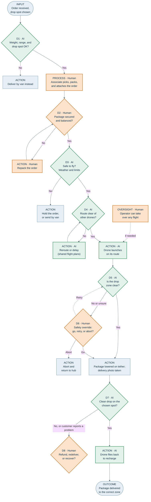

# Aerofleet Delivery: Process Mapping for AI Integration

**ITAI 2372 · Module 01 assignment: Process Mapping for AI Integration**
**Author:** Min Ma Kha
**Industry:** Logistics (last-mile drone delivery)

Aerofleet Delivery flies small retail orders from a store's drone hub to a designated drop zone in the customer's yard, with a 30-minute delivery target. This project maps that workflow using the Input → Process → Decision → Action → Outcome framework and identifies where AI adds value, and where a human must stay in the loop.

## Files

| File | What it is |
|---|---|
| `Aerofleet_Delivery.pptx` | 3-slide presentation: business context, process map, AI integration analysis |
| `aerofleet_delivery_process_map.mermaid` | Mermaid source for the process map (open in [mermaid.live](https://mermaid.live)) |

## Process map

Green = AI step or decision · Orange = human-in-the-loop · Light blue = system step

## AI integration summary

**Where AI fits**
- **D3 · Forecasting and rule checks:** weather and flight limits, checked in the seconds before launch.
- **D4 · Real-time routing:** operators share flight plans and routes adjust automatically.
- **D5 · Computer vision:** detects people, pets, and objects in the drop zone.
- **D7 · Telemetry validation:** confirms the exact drop coordinates with RTK GPS.

**Where AI does not fully fit**
- **D2 · Packing check:** securing and balancing a package is hands-on work.
- **D6 · Safety override:** nuanced visual judgment (lawn ornament vs. pet) and final safety accountability.
- **D8 · Customer problems:** needs empathy and judgment about whether a claim is genuine.

**Data requirements:** real-time weather feeds, live UTM air-traffic data and flight plans, RTK GPS telemetry and battery logs, residential image datasets for object detection, delivery photos and customer claims.

## Sources

- Chain Store Age: [Walmart builds drone delivery capability in Greater Houston](https://chainstoreage.com/walmart-builds-drone-delivery-capability-greater-houston)
- DroneXL: [Walmart and Wing launch drone delivery in Houston](https://dronexl.co/2026/01/16/walmart-wing-drone-delivery-houston/) (January 2026)
- Dronelife: [Flytrex and Wing report zero airspace conflicts](https://dronelife.com/2026/06/25/flytrex-and-wing-report-zero-airspace-conflicts-for-multi-operator-drone-delivery/) (June 2026)
- FAA: proposed 14 CFR Part 108, Normalizing Unmanned Aircraft Systems Beyond Visual Line of Sight Operations (NPRM, August 2025)
